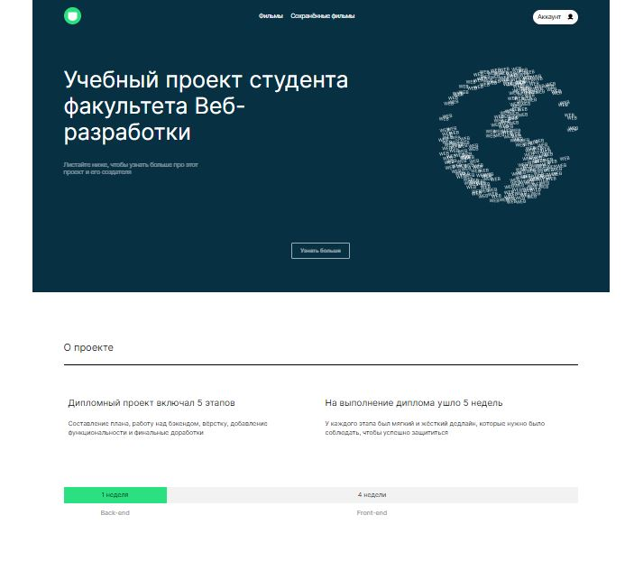
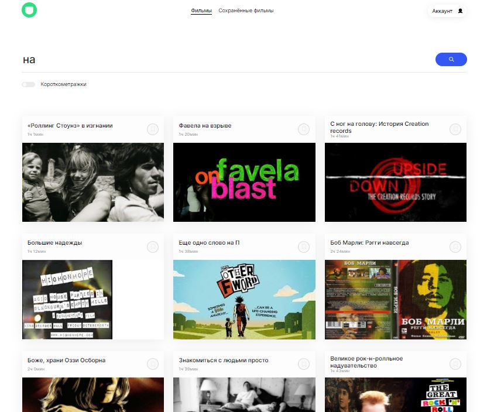
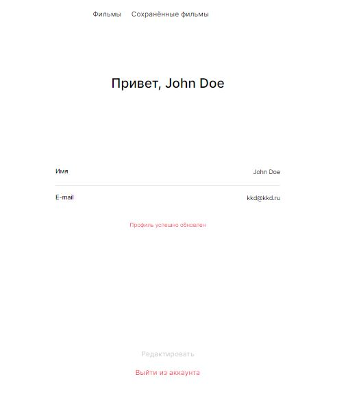
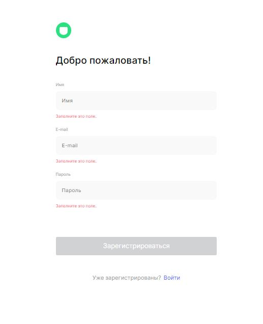

# Movies-explorer

## Описание
Фронтенд-часть проекта по поиску фильмов на Реакте. Включает в себя 2 раздела:
### **Информационный**
Содержит информацию о проекте, использованных технологиях, студенте и его проектах.

  

### **Раздел с поиском фильмов**
Можно искать фильмы. Можно сохранять фильмы. Можно их удалять. Но с предварительной регистрацией. Фильтрация запросов к API сделана на стороне клиента, чтобы было веселее и интереснее.

  

  
    

## Скрипты для работы (стандартные для реакта)

#### `npm start`

#### `npm test`

#### `npm run build`

#### `npm run eject`

## Ссылки на проект
### Адрес
https://ihomeer-movies.nomoredomains.monster/

### Публичный IP
51.250.97.167

## Доработка:

1. Пофиксить баги с чекбоксом "короткометражки"
2. Сделать темную тему и кнопку для ее включения
